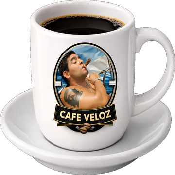

<h1 align="center">
  
  <br>Cafe Veloz
</h1>

<p align="center">App de menu bar para macOS que mantiene tu Mac despierta usando <code>caffeinate -di</code>.<br>Un widget flotante con la taza de Cafe Veloz como indicador visual.</p>

## Funcionalidades

- **Widget flotante** — Taza de cafe draggable que se puede mover a cualquier posicion de la pantalla. Sin bordes, sin ventana, solo la taza.
- **Toggle con click** — Un click en la taza alterna entre prendido (opaco, colores saturados) y apagado (translucido, desaturado).
- **Doble click** — Oculta/muestra el widget.
- **Menu bar** — Icono en la barra superior con menu para controlar el cafe, visibilidad del widget, auto-apagado, y login item.
- **Auto-apagado** — Presets de 1h, 2h, 4h, 8h con countdown visible en el widget y la barra de menu.
- **Abrir al iniciar sesion** — Registro como login item via `SMAppService`.
- **Sonidos** — Feedback auditivo al prender/apagar (Purr/Tink del sistema).
- **Posicion persistente** — La posicion del widget se guarda en `UserDefaults` y se restaura al reabrir.

## Requisitos

- macOS 14+
- Swift 6.0+ / Xcode 16.2+

## Build

```bash
swift build                   # Debug
swift build -c release        # Release
```

## Tests

```bash
swift test                    # 22 tests
```

Los tests usan inyeccion de dependencias con fakes (`FakeProcess`, `MuteSoundPlayer`, `FakeTimerProvider`). No requieren UI ni permisos especiales.

## Instalar

```bash
bash install.sh
```

Genera `CafeVeloz.app` en `~/Applications/` con icono, `Info.plist`, y firma ad-hoc. Tambien copia a `/Applications/` si existia una version previa.

## Pipeline

```bash
bash scripts/pipeline.sh      # Test + build release + empaquetado en dist/
```

CI con GitHub Actions: [`.github/workflows/ci.yml`](.github/workflows/ci.yml)

## Arquitectura

```
Sources/CafeVeloz/
  App/
    CafeVelozApp.swift               Entry point (@main)
    AppDelegate.swift                 Menu bar, window config, login item
  Core/
    CaffeinateController.swift        Controlador principal (start/stop/toggle)
    CaffeinateProcessLaunching.swift  Protocolo para inyeccion de proceso
    SoundPlayer.swift                 Protocolo + impl para sonidos
    AutoOffTimer.swift                Timer auto-apagado con presets
  UI/
    CoffeeWidgetView.swift            Widget flotante draggable (SwiftUI)
    WindowAccessor.swift              NSViewRepresentable para acceso a NSWindow
  Resources/
    coffee_cup.png                    Widget 1x (180x180)
    coffee_cup@2x.png                 Widget 2x (360x360)
    Assets.xcassets/                  App icon (16-1024px)

Tests/CafeVelozTests/
  CaffeinateControllerTests.swift     11 tests — start, stop, toggle, sounds, timer
  AutoOffTimerTests.swift             7 tests  — countdown, expiry, formatting
  SoundPlayerTests.swift              4 tests  — sound call counting
```

## Decisiones tecnicas

- **SPM puro** — Sin Xcode project. El `.app` bundle se arma manualmente en `install.sh`.
- **Swift 6 strict concurrency** — `@MainActor` en clases que tocan UI/estado, protocolos `Sendable` para DI.
- **PNG directo en Resources/** — SPM no compila `.car` (Asset Catalogs) correctamente; los PNGs se cargan via `Bundle.module`.
- **Drag via `NSEvent.mouseLocation`** — Coordenadas de pantalla absolutas para drag smooth sin feedback loop de SwiftUI.
- **`caffeinate -di`** — Flag `-d` previene display sleep, `-i` previene idle sleep.
- **`LSUIElement = true`** — La app no aparece en el Dock, solo en la barra de menu.

## Regenerar assets

Si necesitas regenerar los PNGs del widget y el icono desde la imagen fuente:

```bash
python3 scripts/remove_bg_floodfill.py    # Requiere Pillow
```

Este script usa flood fill desde los bordes (no threshold global) para remover el fondo negro preservando pixeles oscuros interiores (cafe, sombras, texto). Detecta y remueve el hueco de la manija automaticamente.
